# Mark: a help desk you actually enjoy talking to

A React chat app for an AI help desk, with **Mark**: a small 3D robot who lives on your screen, reacts to what you type, brings you pizza when you are hungry, bows when you say thanks, and walks away when you drag him into the corner bin. Behind him are three AI agents that can really check your laptop and read and write your files.

> The UI is open source (this repo). The backend it talks to (login service, AI agents, tools) is a separate **private** repo; this README explains how it works so you can see the whole picture.

## ▶ Try Mark live

### **[temptation4.github.io/mark-help-desk-ui](https://temptation4.github.io/mark-help-desk-ui/)**

Sign in with any email and password and say hello. It runs entirely in your browser with no backend, so it is a **demo mode**:

- **Real:** Mark himself. His reactions, the dragging and the corner bin all work. Try *"i want pizza"*, *"dance for me"*, *"thank you"*, *"you are so cute"* or *"do some magic"*.
- **Canned:** the login and the answers of the three agents (the real ones need the Java backend and local AI models). Voice, file upload and the laptop/file tools are switched off.

To see the agents doing real work (checking a laptop, reading and saving files), watch the video below. To run the demo yourself: `npm run build:demo` (output in `dist/`) or `VITE_DEMO=true npm run dev`.

### Watch the full demo video

[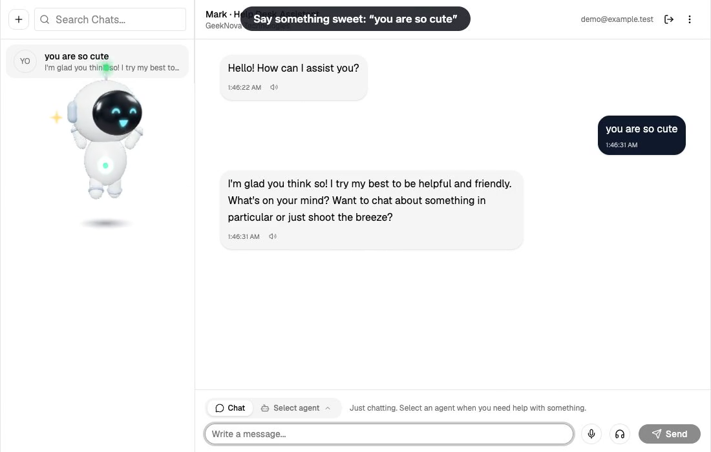](docs/media/mark-demo.mp4)

*Click the picture to play the full demo (about 2.5 minutes). Everything in it is recorded from the real app, nothing is mocked.*

## Talking to Mark is fun

Mark is built from code only: no model files, no video. Every pose is animated procedurally in Three.js, and a small rule engine reads your message *before* the AI answers, so he reacts instantly.

| You say | Mark does |
|---|---|
| *(you open a chat)* | walks in and waves hello |
| "you are so cute" | melts with happy eyes and floating hearts |
| "thank you so much" | gives a polite Korean bow with 감사합니다 |
| "it is my birthday today!" | arrives with balloons and a cake |
| "i am so hungry, i want pizza" | pulls out a pizza (also noodles, momos, burgers, ice cream, coffee, fruit...) |
| "dance for me" | dances (also spins, jumps, claps, cheers) |
| "do some magic" | does a magic trick |
| "i am so sleepy zzz" | yawns and falls asleep with floating Zs |
| "you are stupid" | gets hurt and sad |

| | |
|---|---|
| 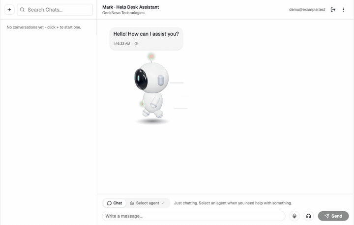 | 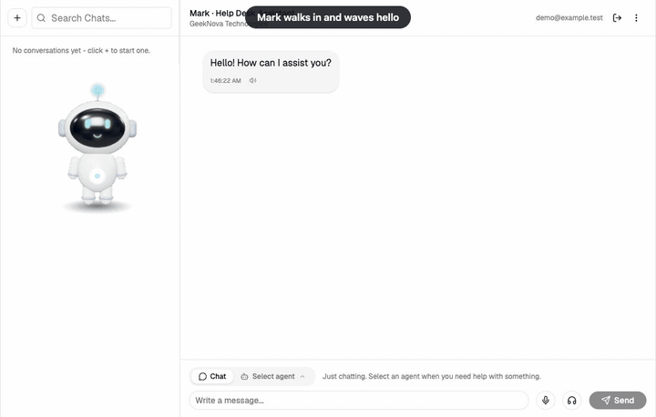 |
| 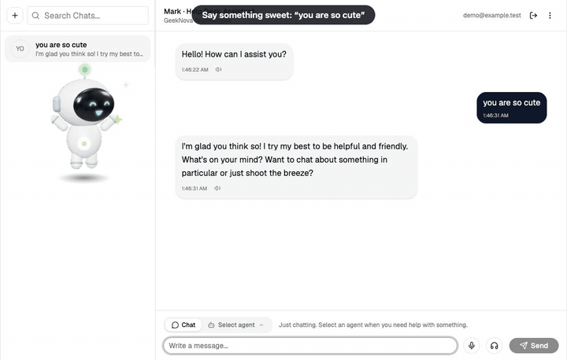 | 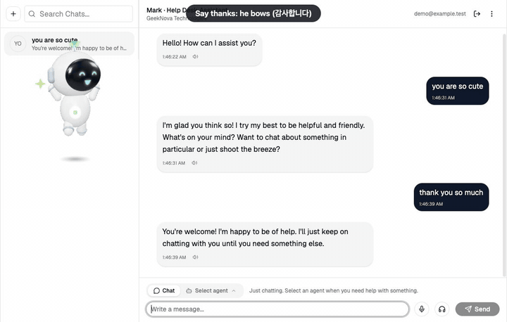 |
| 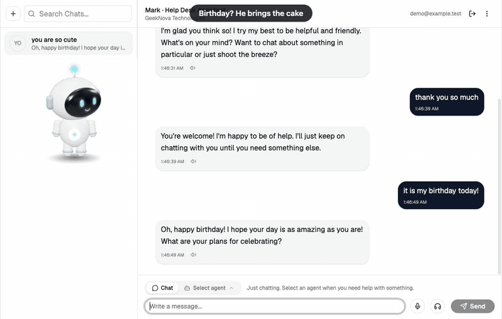 | 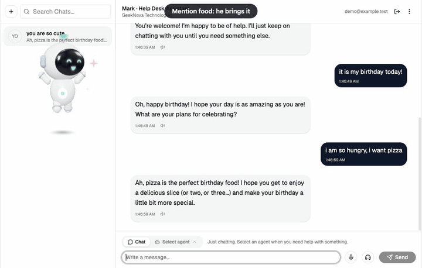 |
| 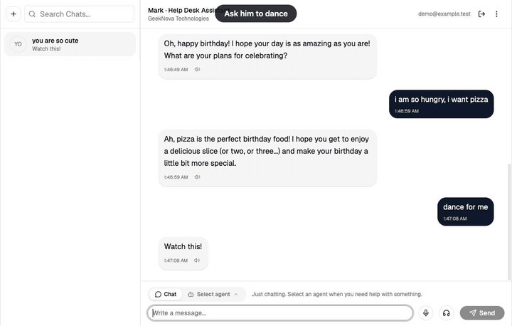 | 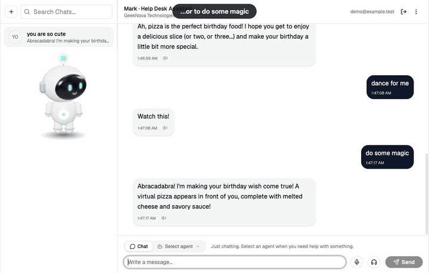 |
| 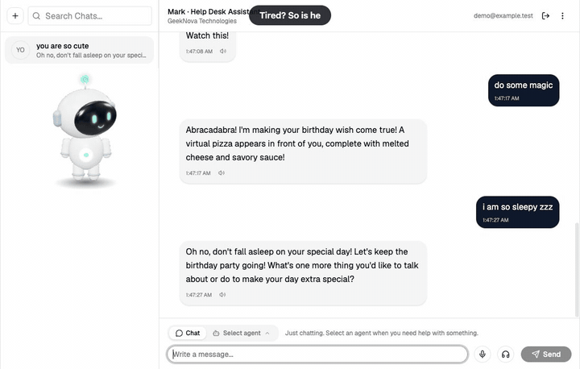 | |

### Pick him up, put him anywhere, or send him away

Drag Mark and he dangles from your pointer. Let go and he stays where you dropped him. Drag him into the **bin in the bottom-right corner** (it grows and turns red as he gets close, and he shrinks into it) and he goes away until you bring him back with a new chat, a new login, the "Call Mark" button, or by typing *"come robo, where are you"*.

| Drag him anywhere | Send him away | Call him back |
|---|---|---|
| 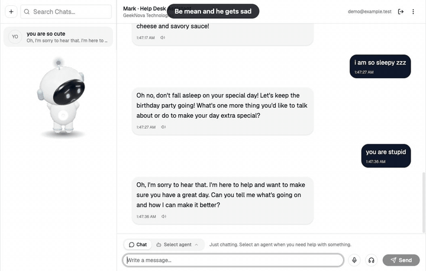 | 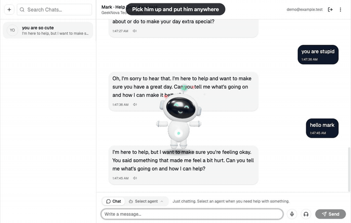 | 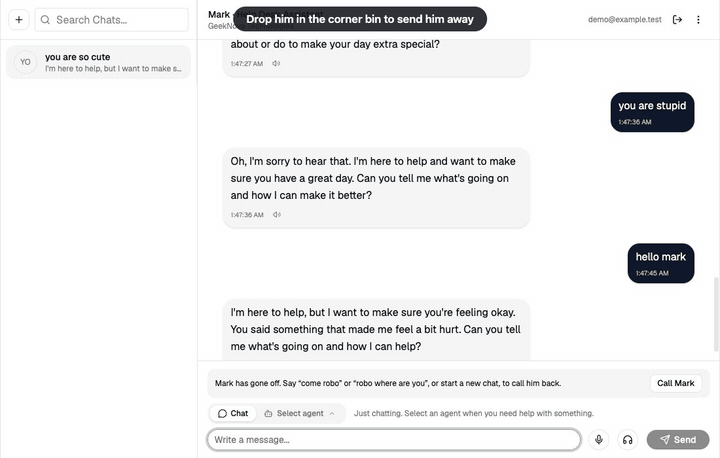 |

## The backend agents

Mark is the face. Behind the chat there are three **agents**, each a different prompt plus different tools. You pick one under the message box ("Chat", or "Select agent"), and the UI sends it in an `Agent` header with every message.

| Agent | What it is for | What it can use |
|---|---|---|
| **Chat** | Friendly conversation and general questions | Nothing but the model |
| **Troubleshoot** | "My wifi keeps disconnecting", "my laptop is slow" | Ticket tools (look up, create and update support tickets) and 13 **laptop check tools** through an MCP server: Wi-Fi status, connected network, internet, DNS, ping, a full Wi-Fi diagnosis, CPU, memory, disk, uptime and top processes. It runs a check first, tells you what it found, and opens a ticket only if the problem is still there. |
| **Interview prep** | Review your resume, write one, practise a mock interview, write and save sample code projects | Real **file tools** through an MCP server (list, search, read and write files in one allowed folder). It can read your resume, save a new one, and save a code project for you. You can also upload a resume or job description. It can also help with a **job search** (see below). |

### Troubleshoot agent: checks your real laptop

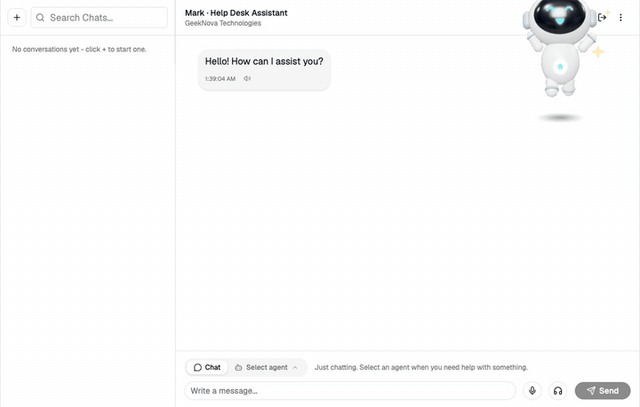

Mark called the `checkWifiStatus` tool on the machine the backend runs on, and the reply lists the tools he actually used.

### Interview agent: reads and writes real files

| Reads your resume | Saves a code project |
|---|---|
| 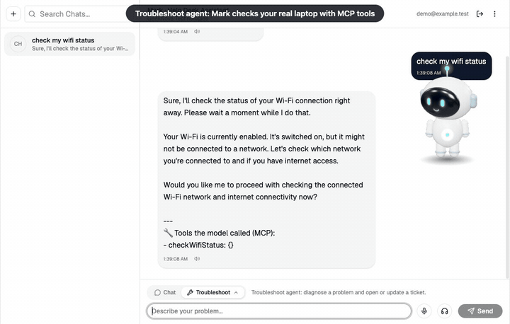 | 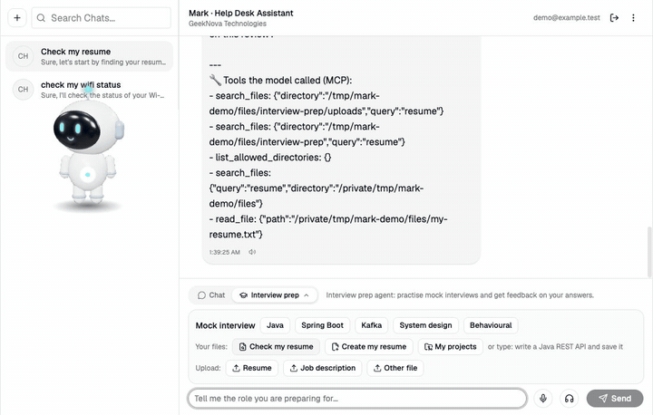 |

He searched the allowed folder, read the resume with `read_file`, and gave feedback. Then he created a folder and saved the Java file with `write_file`. The "Tools the model called" list is added by the backend, so you can always see what the model really did.

### Job search inside the Interview agent

The Interview agent can find real jobs, match them to your profile and prepare applications, through a separate MCP server (the job agent) that is protected with **OAuth2** (client credentials). In the UI this is the **Jobs** row of the Interview panel: the job sources and whether each is connected, quick buttons, and your **Applications**.

- **Real listings** come from official job APIs (Arbeitnow and Remotive need no key; Adzuna, with your own free key, covers India). **Naukri has no public API**, so Mark only gives you a Naukri search link to open and sign in to yourself: the agent never asks for a Naukri password, logs in or scrapes.
- **Matching** is a calculated 0-100 score with matched and missing skills, not a guess.
- **Nothing is ever sent for you.** Mark prepares a *draft* cover note from your profile. **You** read it and press **Approve** (the AI has no way to), then **Open apply page** takes you to the job's own site where you submit it, and **I applied** records it.
- The AI is checked: a job link that no tool returned, or a cover letter it wrote itself instead of saving a draft, is thrown away and asked again.

The hosted demo has a made-up draft so you can try the Approve and apply buttons.

### How the backend fits together

```
React UI (this repo, Mark)
   |  /api/v1/auth/*                  /api/v1/helpdesk/stream (chat, one agent per message)
   v                                   /api/v1/interview/*     (interview actions)
auth-service  ----- signs JWTs ----->  help-desk (Spring Boot + Spring AI)
 (own database,   (RS256, public key         |-- Ollama: llama3.2 for chat, qwen2.5:7b for the agents that use tools
  login/register)  published as JWKS)        |-- conversation memory (per user)
                                             |-- MCP client --> laptop-troubleshooting-mcp   (Troubleshoot)
                                             |-- MCP client --> java-mcp-filesystem-server   (Interview prep)
                                             '-- reply guard: retries empty answers, tool calls written as text, invented ticket ids
```

- **Spring Boot 4, Java 21, Spring AI 2** with local models through **Ollama**; the models run on your own machine.
- **Login is its own microservice** (`auth-service`). It issues RS256 tokens and publishes its public key; the help-desk service only *verifies* tokens and never sees a password.
- **MCP (Model Context Protocol)**: the agents get their tools from small separate MCP servers, so tools can be added without touching the agent code.
- **Honest agents**: replies list the tools the model actually called, and the reply guard throws away answers that mention a ticket that does not exist.
- Voice: speech-to-text and text-to-speech are optional extras in the backend.

## Sign in

The sign-in page offers **email and password** and **Continue with Google** (OAuth2 / OpenID Connect). The Google button uses Google's own sign-in; the backend checks Google's signed ID token against Google's public keys before it signs you in, so the UI never handles a Google password or secret. It appears active when the auth service has a Google client id (the UI reads it from `/api/v1/auth/config`), and is shown switched off with a note when it does not. The hosted demo has a demo version of the button.

## Run the UI

```bash
npm install
npm run dev          # http://localhost:5173
```

The dev server proxies to the backend (defaults: auth service on `:8090`, help-desk on `:8089`). Point it elsewhere with:

```bash
AUTH_URL=http://localhost:8097 BACKEND_URL=http://localhost:8096 npm run dev
```

Without the backend the UI loads, but you cannot log in or chat.

## How Mark works (for the curious)

| File | What it does |
|---|---|
| `src/lib/robot3d.js` | The robot itself: a procedural Three.js model with many poses and moods |
| `src/lib/robotProps.js` | The props he carries: cake, pizza, noodles, coffee cups, shopping bags... |
| `src/lib/mood.js` | The rule engine that turns what you type (or what he answers) into a mood, and hides stage directions like `*beams*` from the chat |
| `src/components/RoamingRobot.jsx` | His life on screen: walks in, waits, leaves, reacts, can be dragged, and goes away in the bin |
| `src/components/MoodAvatar.jsx` | Puts the 3D scene into React and makes his eyes follow your pointer |
| `src/pages/Chat.jsx` | The chat, the agent picker, the interview panel and the voice buttons |

```bash
npm run lint
npm run build
```

Built with React 19, Vite, Tailwind, shadcn/ui and Three.js.

## Re-making the videos

The clips in `docs/media` were recorded by driving a real browser against the running app (typing, dragging) with a small script, not edited by hand. See [docs/record-demo.md](docs/record-demo.md).
